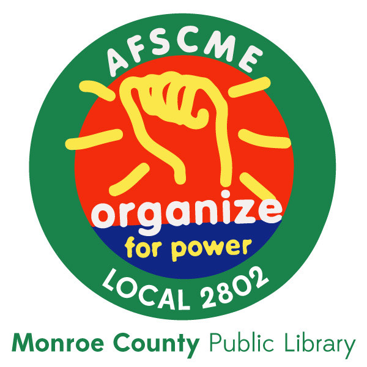

# MCPL Union, AFSCME Local 2802

 **Why Join the Union?**
AFSCME Local 2802 members have an independent strength in numbers that is powerful. We regularly meet outside of work for both meetings and social events where we can freely express concerns and share our perspectives. Our goal is to help make the library a comfortable, respectful place to work, where every voice is heard. All union-eligible staff members are always welcome to join meetings or social events. We look forward to connecting with you!

At the library, being a part of the union means having a seat at the table with management. Three union members sit on the Labor-Management Committee (LMC). They meet regularly with the three library admin LMC representatives to address all manner of issues brought up by staff.

Our union, AFSCME (the American Federation of State, County and Municipal Employees – AFL-CIO), represents the interests of workers in both state and national governments, advancing progressive legislation that protects workers’ rights. As members of AFSCME, we also get access to benefits like discounts on auto insurance, scholarships, and others. Visit [afscme.org](https://afscme.org) to learn more.

## Current Union Officers

- President: Paula Gray-Overtoom 
- Vice President: Nadja Kowalchuk 
- Secretary/Treasurer: Lauren Ondrejack 

**Executive Board:** 
- All current officers, as listed above
- Avalon Snell 
- Mik Breeze 
- Dakota Erickson 

**Stewards:**
- Paul Duszynski 
- Levi Groenewold 
- Jen Hoffman 
- Avalon Snell 
- Mik Breeze 
